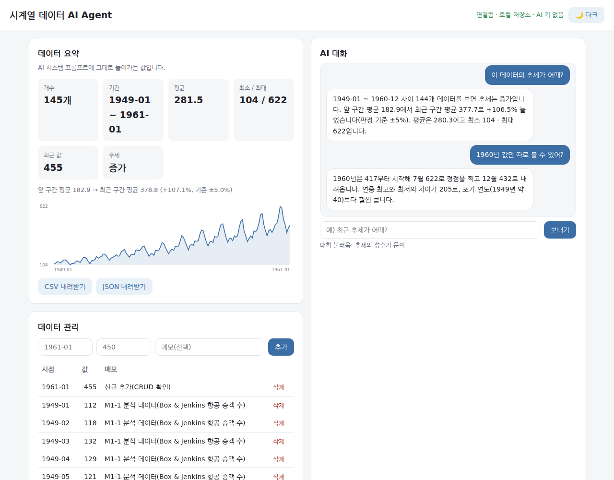
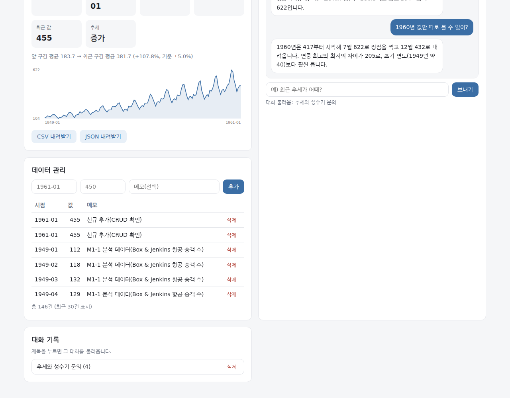

# 시계열 데이터 AI Agent (M1-2)

시계열 데이터를 저장하고, 그 **요약을 시스템 프롬프트에 주입**해 GPT 와 대화하는 풀스택
서비스입니다. "이 데이터 추세가 어때?" 라고 물으면 AI 가 **실제 저장된 데이터에 근거해**
답합니다.

| 항목 | 값 |
|---|---|
| 백엔드 | FastAPI (라우터/서비스/저장소 3계층) |
| 프론트엔드 | 순수 HTML · CSS · JavaScript (프레임워크 없음) |
| 데이터베이스 | Firebase Firestore (자격 없으면 로컬 JSON 으로 자동 전환) |
| AI | OpenAI GPT — 컨텍스트 주입 + 도구 호출(Function Calling) |
| 배포 | 백엔드 Render · 프론트 Vercel |
| 데이터 | 항공 승객 수 144개월 (**M1-1 분석 데이터 계승**) |

---

## 무엇을 해결하나

데이터를 가진 사람은 많지만, **그 데이터에 대해 물어볼 상대**는 없습니다. 스프레드시트를
열어 직접 계산하거나, 분석 도구를 배워야 하죠.

이 서비스는 그 사이를 메웁니다 — 데이터를 넣어 두면 **평소 말하듯 물어보면** 됩니다.
GPT 는 우리 데이터베이스를 볼 수 없으므로, 서버가 **요약을 만들어 대화 시작 전에 알려
주는 방식**(컨텍스트 주입)으로 연결했습니다.

---

## 이 미션의 위치

| | 미션 | 무엇을 주고받나 |
|---|---|---|
| 이어받음 | **M1-1** (데이터 분석 리포트) | **분석 데이터 144개월 + `summary.json`** — `python -m backend.seed` 가 그대로 적재한다 |
| 이어받음 | **A1-3** (AI 웹 서비스) | 순수 HTML/CSS/JS 구성, 프론트-백엔드 JSON 계약, 실패 안내 3종 |
| 넘겨줌 | **M2-1 · M2-2 · M2-3** | FastAPI + 저장소 + AI 서비스 골격 |

M1-1 은 데이터를 **분석**했고, M1-2 는 그 결과를 **대화 가능한 서비스**로 만듭니다.
같은 데이터를 두 번 만들지 않습니다.

### 왜 이 데이터를 골랐나

항공 승객 수(Box & Jenkins, 1949~1960 · 144개월)를 고른 이유는 셋입니다.

| 이유 | 설명 |
|---|---|
| **AI 가 답할 거리가 많다** | 추세·계절성·변동성이 모두 뚜렷해 "언제가 성수기야?" "나빠지고 있어?" 같은 질문이 자연스럽게 나온다. 평평한 데이터였다면 요약 주입의 값어치를 보여 줄 수 없다 |
| **요약과 원본의 차이가 드러난다** | 144개를 통째로 프롬프트에 넣으면 토큰이 커지고, 요약만 넣으면 "1960년 3월 값"은 답할 수 없다. **도구 호출이 왜 필요한지**가 이 데이터에서 실제로 드러난다 |
| **검증이 가능하다** | 공개 데이터라 AI 답변의 숫자가 맞는지 사람이 대조할 수 있다. 사내 데이터였다면 "그럴듯한데 맞나?"를 확인할 방법이 없다 |

요구 조건(100개 이상)도 144개로 충족합니다.

```bash
python -m backend.seed
# → 적재 144건 → 저장소(local)
# → M1-1 요약 대조 — 기간 1949-01 ~ 1960-12 · 144개 · 평균 280.3
```

---

## 배포 URL

| 대상 | 주소 |
|---|---|
| 프론트엔드 (Vercel) | **실제 연동 시 이 자리** — `https://<프로젝트>.vercel.app` |
| 백엔드 API (Render) | **실제 연동 시 이 자리** — `https://<서비스>.onrender.com` |
| Swagger 문서 | **실제 연동 시 이 자리** — `https://<서비스>.onrender.com/docs` |

> ⚠ 이 저장소는 학습용 예시 답안이라 실제 Render·Vercel·Firebase 프로젝트를 연결하지
> 않았습니다. 아래 [배포 방법](#배포-방법)대로 하면 위 자리에 주소가 들어갑니다.
> **연결 없이도 로컬에서 전 기능이 동작합니다**(Firestore 는 로컬 저장소로 자동 전환).

---

## 로컬 실행 방법

### 1) 백엔드

```bash
git clone https://github.com/dicia-jhoh/codyssey-m1-2.git
cd codyssey-m1-2

python3 -m venv .venv && source .venv/bin/activate   # Windows: .venv\Scripts\activate
pip install -r requirements.txt

cp .env.example .env        # 값을 실제 키로 채웁니다(키 없이도 서버는 뜹니다)
python -m backend.seed      # M1-1 데이터 144건 적재

uvicorn backend.main:app --reload
```

- API: http://localhost:8000
- **Swagger UI: http://localhost:8000/docs**
- 헬스체크: http://localhost:8000/ — 현재 저장소·AI 준비 여부를 알려 줍니다

### 2) 프론트엔드

```bash
cd frontend
python3 -m http.server 5500
# 브라우저에서 http://localhost:5500
```

⚠ 프론트 포트가 기본 허용 목록에 없으면 **CORS 로 막힙니다.** 백엔드를 띄울 때
허용 출처를 알려 주세요.

```bash
ALLOWED_ORIGINS="http://localhost:5500" uvicorn backend.main:app --reload
```

---

## 환경 변수

| 이름 | 필수 | 쓰임 |
|---|---|---|
| `OPENAI_API_KEY` | AI 대화에 필수 | GPT 호출. 없으면 `/api/chat` 이 503 과 안내를 돌려준다 |
| `FIREBASE_SERVICE_ACCOUNT_JSON` | 배포에 필수 | 서비스 계정 키 **JSON 문자열**. 없으면 로컬 저장소로 전환 |
| `FIREBASE_SERVICE_ACCOUNT_PATH` | 선택 | 위 대신 파일 경로로 줄 때 |
| `ALLOWED_ORIGINS` | 배포에 필수 | CORS 허용 도메인(쉼표 구분). 프론트 주소를 넣는다 |
| `API_BASE_URL` | 프론트 | 백엔드 주소. 정적 배포라 `frontend/js/api.js` 상수 또는 `window.__API_BASE__` 로 준다 |

**서비스 계정을 JSON 문자열로 받는 이유**: 파일 경로 방식은 배포 환경에 키 파일을 올려야
해서 번거롭고, 실수로 저장소에 커밋될 위험이 있습니다. 문자열이면 **그런 파일이 아예
없습니다.**

```python
    raw = os.environ.get(FIREBASE_JSON_NAME, "").strip()
    if raw:
        try:
            return json.loads(raw)
        except json.JSONDecodeError:
            # 잘못된 JSON 을 조용히 무시하면 "왜 Firestore 가 안 붙지" 를 찾기 어렵다
            raise ValueError(
                f"{FIREBASE_JSON_NAME} 가 올바른 JSON 이 아닙니다. "
                "서비스 계정 키 파일 내용을 그대로 한 줄로 넣었는지 확인하세요."
            ) from None
```

---

## 프로젝트 구조 — 왜 이렇게 나눴나

```text
codyssey-m1-2/
├── backend/
│   ├── main.py            FastAPI 앱 · CORS · 라우터 등록 · 헬스체크
│   ├── config.py          환경 변수 (키는 이름만 안다)
│   ├── models.py          Pydantic 요청·응답 스키마
│   ├── db.py              저장소 — Firestore / 로컬 자동 전환
│   ├── seed.py            M1-1 데이터 적재
│   ├── routers/
│   │   ├── data.py           CRUD 4개 + 요약 + 통계
│   │   ├── conversations.py  대화 저장·목록·상세·삭제
│   │   └── chat.py           AI 대화(요약 주입 → GPT → 자동 저장)
│   └── services/
│       ├── summary.py        요약 계산 · 추세 판정 · 시스템 프롬프트 생성
│       └── ai.py             GPT 호출 · 도구 호출(Function Calling)
├── frontend/
│   ├── index.html         화면 4구역(요약·채팅·데이터 관리·대화 기록)
│   ├── css/style.css      변수 → 컴포넌트 → 반응형 → 다크 모드
│   └── js/
│       ├── api.js            백엔드 호출 한곳에
│       └── app.js            화면 로직
├── data/                  M1-1 계승 데이터
└── images/                제출 스크린샷
```

**나눈 기준은 "바뀌는 이유"** 입니다.

| 계층 | 무엇이 바뀔 때 바뀌나 | 없는 것 |
|---|---|---|
| `routers/` | 경로·상태 코드·요청 형식 | 통계 공식, SQL |
| `services/` | 계산 방법·프롬프트·모델 | HTTP 상태 코드 |
| `db.py` | 저장소 종류 | 비즈니스 규칙 |
| `models.py` | 주고받는 모양 | 로직 |

라우터를 **URL 접두사 하나당 파일 하나**로 나눈 이유: 한 파일에 전부 넣으면 엔드포인트가
늘어날수록 어디를 고칠지 찾기 어렵고, 여러 사람이 동시에 작업할 때 충돌합니다.

---

## API 엔드포인트

### 데이터 (`/api/data`)

| 메서드 | 경로 | 하는 일 |
|---|---|---|
| POST | `/api/data` | 새 데이터 추가 (201) |
| GET | `/api/data` | 목록 조회 |
| PUT | `/api/data/{id}` | 수정 (없으면 404) |
| DELETE | `/api/data/{id}` | 삭제 (204, 없으면 404) |
| GET | `/api/data/summary` | **요약 — 프롬프트 주입용** |
| GET | `/api/data/statistics` | 추가 통계(보너스) |

⚠ **경로 순서가 중요합니다.**

```python
@router.get("/summary", response_model=SummaryOut, summary="데이터 요약(프롬프트 주입용)")
def get_summary() -> SummaryOut:
    """데이터 요약을 돌려준다. **이 응답이 AI 시스템 프롬프트에 들어간다.**

    ⚠ 경로 순서 주의: 이 라우트는 `/{data_id}` **보다 위에** 있어야 한다. 아래에 두면
    FastAPI 가 `summary` 를 id 로 읽어 `/api/data/summary` 요청이 상세 조회로 간다.
    """
```

### 대화 (`/api/conversations`)

| 메서드 | 경로 | 하는 일 |
|---|---|---|
| POST | `/api/conversations` | 대화 저장 |
| GET | `/api/conversations` | 목록 — **messages 는 비워서** 돌려준다 |
| GET | `/api/conversations/{id}` | 상세 — **전체 messages** |
| DELETE | `/api/conversations/{id}` | 삭제 |

미션이 요구한 "대화 불러오기 UX" 조건 (A)·(B)를 **둘 다** 충족합니다.

- **(B)** 목록 응답에 `messages` 포함 여부를 명확히 정의 → **비운다**(`message_count` 만 준다)
- **(A)** 전체 내용은 `GET /api/conversations/{id}` 로 조회

나눈 이유: 대화가 쌓이면 목록 응답이 급격히 커집니다. 프론트의 "불러오기"는 목록에서 고른
뒤 상세를 부르는 흐름입니다.

### AI 대화 (`/api/chat`)

미션이 정한 흐름을 그대로 구현했습니다.

```text
POST /api/chat  {"message": "추세가 어때?", "conversation_id": null}
   │
   ├─ ① 데이터 요약 조회        services/summary.compute_summary()
   ├─ ② 시스템 프롬프트에 삽입   services/summary.build_system_prompt()
   ├─ ③ GPT 호출               services/ai.chat()  ← 필요하면 도구 호출
   └─ ④ 대화 자동 저장          conversations 컬렉션
   │
   ▼
{"reply": "...", "conversation_id": "abc", "used_summary": true, "tool_calls": [...]}
```

**자동 저장을 이 엔드포인트에 둔 이유**: 사용자가 "저장" 버튼을 누르기를 기다리면 대부분
저장되지 않습니다. 대화는 **일어난 사실**이므로 그 자리에서 남기는 편이 맞습니다.

### 구현 코드

#### 데이터 CRUD — `backend/routers/data.py`

생성은 201, 수정·삭제는 대상이 없으면 404 를 돌려줍니다. 검증은 Pydantic 이 함수에
들어오기 **전에** 끝냅니다.

```python
@router.post("", response_model=DataPointOut, status_code=status.HTTP_201_CREATED,
             summary="새 데이터 추가")
def create_data(payload: DataPointIn) -> DataPointOut:
    """데이터 1건을 추가한다. 검증은 Pydantic 이 이 함수에 들어오기 전에 끝낸다."""
    record = db.get_repository().add(db.COLLECTION_DATA, payload.model_dump())
    return DataPointOut(**_normalize(record))


@router.put("/{data_id}", response_model=DataPointOut, summary="데이터 수정")
def update_data(data_id: str, payload: DataPointIn) -> DataPointOut:
    """데이터 1건을 수정한다. 없으면 404."""
    record = db.get_repository().update(db.COLLECTION_DATA, data_id, payload.model_dump())
    if record is None:
        raise HTTPException(status_code=404, detail=f"데이터를 찾을 수 없습니다: {data_id}")
    return DataPointOut(**_normalize(record))


@router.delete("/{data_id}", status_code=status.HTTP_204_NO_CONTENT, summary="데이터 삭제")
def delete_data(data_id: str) -> None:
    """데이터 1건을 삭제한다. 없으면 404.

    204(No Content)를 쓰는 이유: 삭제 성공에는 돌려줄 내용이 없다. 200 에 빈 객체를
    넣는 것보다 의미가 분명하다.
    """
    if not db.get_repository().delete(db.COLLECTION_DATA, data_id):
        raise HTTPException(status_code=404, detail=f"데이터를 찾을 수 없습니다: {data_id}")
```

목록 조회는 상한을 두어 응답이 무한정 커지지 않게 합니다.

```python
@router.get("", response_model=list[DataPointOut], summary="데이터 목록 조회")
def list_data(limit: int = 500) -> list[DataPointOut]:
    """등록된 데이터를 최신순으로 돌려준다.

    상한을 두는 이유: 데이터가 수천 개가 되면 응답이 커져 프론트가 느려진다.
    """
    documents = db.get_repository().list(db.COLLECTION_DATA)
    return [DataPointOut(**_normalize(d)) for d in documents[:limit]]
```

저장소 문서를 응답 모델로 옮기는 자리에 기본값을 채웁니다 — 옛 형식 문서가 남아 있어도
응답이 깨지지 않게 합니다.

```python
def _normalize(document: dict) -> dict:
    """저장소 문서 → 응답 모델이 받는 형태.

    저장소에 옛 형식 문서가 남아 있어도 응답이 깨지지 않게 기본값을 채운다.
    """
    return {
        "id": str(document.get("id", "")),
        "period": str(document.get("period", "")),
        "value": float(document.get("value", 0)),
        "note": document.get("note"),
        "created_at": str(document.get("created_at", "")),
    }
```

요약 엔드포인트가 AI 로 들어가는 값을 만듭니다.

```python
@router.get("/summary", response_model=SummaryOut, summary="데이터 요약(프롬프트 주입용)")
def get_summary() -> SummaryOut:
    documents = db.get_repository().list(db.COLLECTION_DATA)
    return SummaryOut(**summary_service.compute_summary(documents))
```

실제 동작 로그입니다.

```text
$ curl -X POST localhost:8000/api/data -H 'Content-Type: application/json' \
    -d '{"period":"1961-01","value":450,"note":"테스트 추가"}'
{"period":"1961-01","value":450.0,"note":"테스트 추가","id":"d65b477ac9ad480dba17", ...}

$ curl -X PUT localhost:8000/api/data/d65b477ac9ad480dba17 -H 'Content-Type: application/json' \
    -d '{"period":"1961-01","value":455,"note":"수정됨"}'
{"period":"1961-01","value":455.0,"note":"수정됨","id":"d65b477ac9ad480dba17", ...}

$ curl -X DELETE localhost:8000/api/data/d65b477ac9ad480dba17 -o /dev/null -w "%{http_code}"
204

$ curl -X DELETE localhost:8000/api/data/nonexistent
{"detail":"데이터를 찾을 수 없습니다: nonexistent"}   [HTTP 404]
```

#### 대화 — `backend/routers/conversations.py`

목록은 `messages` 를 비우고 상세는 채웁니다. 그 차이가 `_to_out` 의 인자 하나입니다.

```python
@router.get("", response_model=list[ConversationOut], summary="대화 목록 조회")
def list_conversations() -> list[ConversationOut]:
    """대화 목록. **messages 는 비워서 돌려준다**(응답 크기 관리 — 미션 (B) 방식)."""
    documents = db.get_repository().list(db.COLLECTION_CONVERSATIONS)
    return [_to_out(d, include_messages=False) for d in documents]


@router.get("/{conversation_id}", response_model=ConversationOut, summary="대화 상세 조회")
def get_conversation(conversation_id: str) -> ConversationOut:
    """대화 1건의 **전체 messages** 를 돌려준다(미션 (A) 방식 — 불러오기 UX)."""
    document = db.get_repository().get(db.COLLECTION_CONVERSATIONS, conversation_id)
    if document is None:
        raise HTTPException(status_code=404, detail=f"대화를 찾을 수 없습니다: {conversation_id}")
    return _to_out(document, include_messages=True)


@router.post("", response_model=ConversationOut, status_code=status.HTTP_201_CREATED,
             summary="대화 저장")
def create_conversation(payload: ConversationIn) -> ConversationOut:
    """대화를 저장한다. `/api/chat` 이 자동으로 부르지만, 직접 부를 수도 있다."""
    record = db.get_repository().add(db.COLLECTION_CONVERSATIONS, {
        "title": payload.title,
        "messages": [m.model_dump() for m in payload.messages],
    })
    return _to_out(record, include_messages=True)


@router.delete("/{conversation_id}", status_code=status.HTTP_204_NO_CONTENT,
               summary="대화 삭제")
def delete_conversation(conversation_id: str) -> None:
    """대화 1건을 삭제한다. 없으면 404."""
    if not db.get_repository().delete(db.COLLECTION_CONVERSATIONS, conversation_id):
        raise HTTPException(status_code=404, detail=f"대화를 찾을 수 없습니다: {conversation_id}")
```

목록과 상세의 응답 차이를 실제로 확인한 로그입니다.

```text
$ curl localhost:8000/api/conversations
[{"id":"f5924dd93ff04ca6bfb3","title":"추세 문의","message_count":2,"messages":[]}]

$ curl localhost:8000/api/conversations/f5924dd93ff04ca6bfb3
{"id":"f5924dd93ff04ca6bfb3","title":"추세 문의","message_count":2,
 "messages":[{"role":"user","content":"이 데이터 추세가 어때?"}, ...]}
```

#### AI 대화 — `backend/routers/chat.py`

미션이 정한 4단계가 함수 하나에 순서대로 들어 있습니다.

```python
@router.post("", response_model=ChatOut, summary="AI 대화")
def chat(payload: ChatIn) -> ChatOut:
    """질문을 받아 데이터 요약을 넣고 GPT 에 묻는다. 대화는 자동 저장된다."""
    repository = db.get_repository()
    documents = repository.list(db.COLLECTION_DATA)

    # ① 이어 갈 대화가 있으면 이전 메시지를 불러온다(맥락 유지)
    history: list[dict] = []
    conversation = None
    if payload.conversation_id:
        conversation = repository.get(db.COLLECTION_CONVERSATIONS, payload.conversation_id)
        if conversation is None:
            raise HTTPException(
                status_code=404,
                detail=f"대화를 찾을 수 없습니다: {payload.conversation_id}",
            )
        history = conversation.get("messages") or []

    # ②③ 요약 주입 + GPT 호출
    try:
        reply, used_tools = ai_service.chat(payload.message, history, documents)
    except ai_service.AIUnavailable as exc:
        # 503 — 서버는 살아 있지만 외부 의존(AI)을 쓸 수 없다는 뜻
        raise HTTPException(status_code=503, detail=str(exc)) from exc

    # ④ 대화 저장 — 이어 가는 중이면 갱신, 새 대화면 생성
    messages = [*history,
                {"role": "user", "content": payload.message},
                {"role": "assistant", "content": reply}]

    if conversation:
        repository.update(db.COLLECTION_CONVERSATIONS, conversation["id"],
                          {"messages": messages})
        conversation_id = conversation["id"]
    else:
        # 제목은 첫 질문에서 딴다 — 사용자가 목록에서 알아볼 수 있어야 한다
        title = payload.message.strip().replace("\n", " ")[:TITLE_MAX]
        record = repository.add(db.COLLECTION_CONVERSATIONS,
                                {"title": title or "새 대화", "messages": messages})
        conversation_id = record["id"]
```

#### GPT 호출 — `backend/services/ai.py`

```python
        try:
            response = client.chat.completions.create(
                model=config.DEFAULT_MODEL,
                messages=messages,
                tools=TOOL_SCHEMAS,
                # 사실 기반 답변이라 낮게. 같은 데이터에 매번 다른 숫자가 나오면 안 된다.
                temperature=0.2,
                max_tokens=config.MAX_TOKENS,
            )
        except Exception as exc:  # noqa: BLE001 — SDK 예외 종류가 버전마다 다르다
            logger.error("OpenAI 호출 실패: %s", exc)
            raise AIUnavailable(f"AI 호출에 실패했습니다: {exc}") from exc

        choice = response.choices[0].message
        tool_calls = getattr(choice, "tool_calls", None)

        if not tool_calls:
            return (choice.content or "").strip(), used_tools
```

메시지를 조립하는 부분에 컨텍스트 주입과 이력 제한이 함께 들어 있습니다.

```python
    data_summary = summary_service.compute_summary(documents)
    extended = summary_service.extended_statistics(documents)
    system_prompt = summary_service.build_system_prompt(data_summary, extended)

    messages: list[dict] = [{"role": "system", "content": system_prompt}]
    # 이전 대화는 최근 것만 넣는다 — 전부 넣으면 토큰이 무한정 커진다
    for entry in history[-10:]:
        if entry.get("role") in ("user", "assistant") and entry.get("content"):
            messages.append({"role": entry["role"], "content": entry["content"]})
    messages.append({"role": "user", "content": user_message})
```

키가 없을 때는 **조용히 가짜 답을 만들지 않고** 503 과 안내를 돌려줍니다.

```text
$ curl -X POST localhost:8000/api/chat -H 'Content-Type: application/json' \
    -d '{"message":"평균이 얼마야?"}'
{"detail":"환경 변수 OPENAI_API_KEY 가 없어 AI 대화 를 사용할 수 없습니다.
  로컬은 .env 파일에, 배포는 플랫폼 환경 변수에 설정하세요(값은 YOUR_KEY 자리)."}
[HTTP 503]
```

---

## 보안 및 운영 기본

이 절에 흩어진 안전장치를 한곳에 모았습니다.

### ① 키는 코드에 두지 않는다

| 층 | 무엇을 | 어디에 |
|---|---|---|
| 1 | 코드는 **이름만** 안다 | `OPENAI_KEY_NAME = "OPENAI_API_KEY"` |
| 2 | 실제 키 파일을 커밋에서 제외 | `.gitignore` 에 `.env`·`serviceAccountKey.json`·`*-firebase-adminsdk-*.json` |
| 3 | 형식만 공유 | `.env.example` 의 값은 전부 `YOUR_KEY` 자리표시자 |

```python
# 값이 아니라 **이름만** 코드에 둔다.
OPENAI_KEY_NAME = "OPENAI_API_KEY"
FIREBASE_JSON_NAME = "FIREBASE_SERVICE_ACCOUNT_JSON"
FIREBASE_PATH_NAME = "FIREBASE_SERVICE_ACCOUNT_PATH"  # 대안: 파일 경로
ALLOWED_ORIGINS_NAME = "ALLOWED_ORIGINS"
```

키가 유출됐다면 코드에서 지우는 것으로 부족합니다(git 이력에 남습니다). 순서는
① 콘솔에서 **즉시 폐기·재발급** ② 새 키를 환경 변수에 설정 ③ 노출된 커밋 이력 정리
④ 사용량·청구 확인입니다.

### ② 입력 검증

Pydantic 이 요청 본문을 함수 진입 전에 검사합니다. 값 범위(`gt=0`), 길이 상한
(`max_length`), 날짜 존재 여부까지 봅니다.

```python
class ChatIn(BaseModel):
    """AI 대화 요청 — POST /api/chat"""

    message: str = Field(..., min_length=1, max_length=1000, description="사용자 질문")
    conversation_id: str | None = Field(None, description="이어 갈 대화 id(없으면 새로 만든다)")
```

`max_length=1000` 은 보안이자 **비용 방어**입니다 — 긴 입력이 그대로 토큰이 됩니다.

### ③ 예외 처리 — 상태 코드로 원인을 가른다

| 상황 | 코드 | 사용자가 할 일 |
|---|---|---|
| 요청 형식·값이 틀림 | 422 | 입력을 고친다(어느 필드인지 알려 준다) |
| 대상이 없음 | 404 | id 를 확인한다 |
| AI 를 쓸 수 없음 | 503 | 서버 키 설정을 확인한다(관리자) |
| 저장소 연결 실패 | — | **서버가 죽지 않는다.** 로컬로 내려가고 로그에 남긴다 |

마지막 줄이 중요합니다. 배포 중 키가 잘못 설정됐을 때 전체 서비스가 멈추는 것보다,
경고를 남기고 도는 편이 낫습니다.

### ④ 모델 출력을 신뢰하지 않는다

도구 호출은 모델이 정하지만, **실행 여부와 범위는 서버가 정합니다.** 이름은 허용 목록으로
확인하고 인자도 다시 검증합니다(위 [도구 호출](#1-도구-호출-function-calling) 참조).

### ⑤ CORS 는 목록으로 제한한다

`allow_origins=["*"]` 를 쓰지 않습니다. 허용 도메인은 환경 변수로 주고, 기본값에는 로컬
개발 주소만 넣습니다.

### ⑥ 비용 상한

`max_tokens=600` · 이력 최근 10개 · 도구 호출 3왕복 · 입력 1000자 — 네 곳에서 막습니다.

---

## 컨텍스트 주입 — 이 서비스의 핵심 원리

**GPT 는 우리 데이터베이스를 볼 수 없습니다.** 대화 시작 전에 "너는 이런 데이터를 알고
있다"고 **글로 적어 주는 것**이 유일한 통로입니다. 그래서 요약의 품질이 곧 답변의 품질이
됩니다.

```python
    lines = [
        "너는 시계열 데이터 분석 도우미다. 아래는 사용자가 등록한 데이터의 요약이다.",
        "",
        "[데이터 요약]",
        f"- 기간: {summary['period_from']} ~ {summary['period_to']}",
        f"- 개수: {summary['count']}개",
        f"- 평균: {summary['mean']} / 최소: {summary['minimum']} / 최대: {summary['maximum']}",
        f"- 최근 값: {summary['latest_value']}",
        f"- 추세: {summary['trend']} ({summary['trend_basis']})",
    ]
```

### 무엇을 넣을지가 설계 결정이다

원본 144개 값을 통째로 넣으면 **토큰만 커지고 모델이 요약을 다시 해야 합니다.**
"사람이 이 데이터를 한 문단으로 설명한다면 무엇을 말할까"를 기준으로 골랐습니다.

### 지어내기를 막는 규칙

```python
    lines += [
        "",
        "[답변 규칙]",
        "- 위 요약에 있는 숫자만 사용한다. **요약에 없는 값은 지어내지 마라.**",
        "- 요약으로 답할 수 없는 질문에는 '주어진 요약으로는 알 수 없습니다' 라고 말하고,",
        "  무엇이 더 있으면 답할 수 있는지 알려 준다.",
        "- 추세를 말할 때는 위 근거(앞뒤 구간 평균 비교)를 함께 언급한다.",
        "- 한국어로, 3~5문장으로 간결하게 답한다.",
    ]
```

요약에 없는 값을 물으면 모델은 **그럴듯하게 지어냅니다.** "모른다고 답하라"를 명시해야
그 자리에서 멈춥니다.

### 추세 판정을 AI 가 아니라 코드가 하는 이유

```python
    half = len(values) // 2
    earlier = statistics.fmean(values[:half])
    recent = statistics.fmean(values[half:])
    ...
    change_pct = round((recent - earlier) / earlier * 100, 2)
    basis = (f"앞 구간 평균 {earlier:.1f} → 최근 구간 평균 {recent:.1f} "
             f"({change_pct:+.1f}%, 기준 ±{TREND_THRESHOLD_PCT}%)")
```

AI 에게 "추세가 어때?"라고 물으면 **매번 답이 달라집니다.** 숫자로 정한 규칙이면 같은
데이터에 항상 같은 답이 나오고, 그 근거를 사람이 검증할 수 있습니다.

**앞뒤 절반의 평균**을 비교하는 것도 이유가 있습니다 — 마지막 값 하나만 보면 그 달이
유난히 높거나 낮았을 때 추세를 잘못 읽습니다.

---

## Firestore — 자격이 없으면 로컬로 내려간다

```python
    if credentials_dict:
        try:
            _repository = FirestoreRepository(credentials_dict)
            return _repository
        except Exception as exc:  # noqa: BLE001 — 어떤 실패든 로컬로 내려간다
            logger.error("Firestore 초기화 실패(%s) — 로컬 저장소로 전환합니다", exc)

    _repository = LocalRepository()
    return _repository
```

**왜 이런 장치를 두나**: 키가 없다고 서버가 뜨지도 않으면 ① 채점자가 코드를 돌려 볼 수
없고 ② 프론트 개발자가 백엔드를 기다려야 하고 ③ 테스트에 실물 DB 가 필요해집니다.

**같은 인터페이스를 두 구현이 만족**하게 해서 위쪽(라우터·서비스) 코드는 어느 쪽이
붙었는지 모릅니다.

```python
class Repository(Protocol):
    """저장소 인터페이스 — Firestore 구현과 로컬 구현이 둘 다 만족한다."""

    def add(self, collection: str, document: dict) -> dict: ...
    def list(self, collection: str, *, order_by: str = "created_at") -> list[dict]: ...
    def get(self, collection: str, document_id: str) -> dict | None: ...
    def update(self, collection: str, document_id: str, patch: dict) -> dict | None: ...
    def delete(self, collection: str, document_id: str) -> bool: ...
```

이것이 저장소를 계층으로 분리하는 **실질적인 이유**입니다 — "나중에 DB 를 바꿀 수도
있어서"가 아니라, **지금 당장 두 환경에서 돌려야** 하기 때문입니다.

현재 어느 쪽인지는 헬스체크가 알려 줍니다.

```json
{"status":"ok","storage":"local","ai_ready":false,"docs":"/docs"}
```

배포 후 "왜 데이터가 안 남지?"를 여기서 바로 확인할 수 있습니다. Firestore 키가 잘못
설정되면 `local` 이 뜹니다.

### 컬렉션 구조

| 컬렉션 | 필드 |
|---|---|
| `data` | `period` · `value` · `note` · `created_at` |
| `conversations` | `title` · `messages[]` · `created_at` |

---

## Pydantic 검증 — 입구에서 막는다

```python
    @field_validator("period")
    @classmethod
    def validate_period(cls, value: str) -> str:
        """YYYY-MM 또는 YYYY-MM-DD 만 받는다.

        정규식 대신 `date.fromisoformat` 로 검사하는 이유: 형식이 맞아도 존재하지 않는
        날짜(2026-02-30)를 걸러야 한다. YYYY-MM 은 1일을 붙여 확인한다.
        """
```

**왜 Pydantic 인가**: FastAPI 는 이 모델로 ① 요청 본문을 자동 검증하고 ② 잘못된 요청에
422 와 **어느 필드가 왜 틀렸는지**를 돌려주며 ③ Swagger 문서를 자동 생성합니다.

실제 응답입니다.

```json
{"detail":[{"type":"greater_than","loc":["body","value"],
  "msg":"Input should be greater than 0","input":-5,"ctx":{"gt":0.0}}]}
```

날짜 검증도 어느 값이 왜 거부됐는지 알려 줍니다.

```json
{"detail":[{"type":"value_error","loc":["body","period"],
  "msg":"Value error, period 는 YYYY-MM 또는 YYYY-MM-DD 형식이어야 합니다",
  "input":"2026-02-30"}]}
```

프론트는 이 구조를 그대로 사람 말로 바꿉니다.

```javascript
  /* FastAPI 검증 오류(422)는 어느 필드가 왜 틀렸는지를 담아 준다 — 그대로 보여 준다 */
  if (status === 422 && Array.isArray(data?.detail)) {
    return data.detail
      .map((item) => `${item.loc?.slice(1).join('.') || '입력'}: ${item.msg}`)
      .join('\n');
  }
```

---

## CORS — 왜 필요하고, 무엇을 겪었나

프론트(Vercel)와 백엔드(Render)는 **다른 도메인**에 있습니다. 브라우저는 기본적으로 다른
출처로의 요청을 막으므로(동일 출처 정책), 서버가 "이 출처는 허용한다"고 응답 헤더로
알려 줘야 합니다.

```python
app.add_middleware(
    CORSMiddleware,
    allow_origins=config.get_allowed_origins(),
    allow_credentials=True,
    allow_methods=["GET", "POST", "PUT", "DELETE", "OPTIONS"],
    allow_headers=["*"],
)
```

**`*` 를 쓰지 않는 이유**: 아무 사이트나 이 API 를 부를 수 있게 되고, 쿠키를 쓰는 순간
브라우저가 거부합니다. 허용 도메인은 환경 변수로 줍니다.

### 저작 중 실제로 막혔다

프론트를 8078 포트로 띄웠더니 **전 요청이 차단**됐습니다.

```text
Access to fetch at 'http://127.0.0.1:8000/' from origin 'http://127.0.0.1:8078'
has been blocked by CORS policy: Response to preflight request doesn't pass
access control check: No 'Access-Control-Allow-Origin' header is present
```

프론트 화면에는 이렇게 떴습니다 — **원인을 짚는 문구**를 미리 넣어 둔 덕에 바로 알았습니다.

```javascript
    if (error instanceof TypeError) {
      /* fetch 자체가 실패 — 서버가 꺼졌거나 CORS 가 막혔다 */
      throw new Error(
        `서버(${API_BASE})에 연결할 수 없습니다. 주소와 CORS 설정을 확인해 주세요.`
      );
    }
```

해결은 환경 변수 한 줄입니다.

```bash
ALLOWED_ORIGINS="http://127.0.0.1:8078" uvicorn backend.main:app
# → access-control-allow-origin: http://127.0.0.1:8078
```

배포에서 Vercel 도메인을 넣는 자리와 **정확히 같습니다.**

---

## 프론트엔드 화면

### 제출 스크린샷

**① 데이터 요약이 보이는 채팅 화면 (질문 + 답변 포함)**



왼쪽에 요약 KPI 6개와 추세 근거, 미니 차트가 있고 오른쪽이 대화입니다. 요약 카드의 값이
그대로 시스템 프롬프트에 들어갑니다.

**② 데이터 관리 화면 (CRUD 동작)**



`1961-01 / 455 / 신규 추가(CRUD 확인)` 를 방금 추가해 목록 맨 위에 뜬 상태입니다.
총 건수가 144 → 145 로 늘었고, 요약의 기간·평균도 함께 바뀝니다.

**③ 대화 기록 화면 (불러오기 동작)**


목록에서 제목을 누르면 그 대화가 채팅창에 복원됩니다.

### 로딩 표시

응답이 올 때까지 화면이 멈춘 것처럼 보이면 안 됩니다.

```javascript
    /* 로딩 표시 — 응답이 올 때까지 화면이 멈춘 것처럼 보이면 안 된다 */
    const loading = addBubble('assistant loading', '생각하는 중');
```

### 콜드스타트 안내 (무료 티어 대응)

Render 무료 티어는 일정 시간 요청이 없으면 잠들었다가 다음 요청에 깨어납니다.
**첫 요청이 30초 이상** 걸릴 수 있습니다.

```javascript
  /* 응답이 늦으면 콜드스타트 안내를 띄운다 — 화면이 멈춘 것처럼 보이면 안 된다 */
  const hint = setTimeout(() => {
    const notice = document.getElementById('coldStart');
    if (notice) notice.hidden = false;
  }, COLD_START_HINT_MS);
```

4초가 지나면 배너가 뜹니다: "⏳ 서버가 잠들어 있었습니다(무료 티어). 첫 응답까지 최대
1분 걸릴 수 있습니다." 안내가 없으면 사용자는 **고장났다고 판단하고 떠납니다.**

Swagger 설명에도 같은 안내를 넣었습니다.

---

## 배포 방법

### 백엔드 → Render

1. GitHub 에 코드를 푸시합니다.
2. Render → **New Web Service** → 이 저장소 선택
3. 설정:
   - Build Command: `pip install -r requirements.txt`
   - Start Command: `uvicorn backend.main:app --host 0.0.0.0 --port $PORT`
4. **Environment** 에 환경 변수 등록:
   - `OPENAI_API_KEY`
   - `FIREBASE_SERVICE_ACCOUNT_JSON` (키 파일 내용을 한 줄로)
   - `ALLOWED_ORIGINS` (Vercel 주소)
5. 배포 후 `https://<서비스>.onrender.com/docs` 에서 Swagger 확인

⚠ `--port $PORT` 가 중요합니다. Render 는 포트를 환경 변수로 지정하며, 8000 을 고정하면
**연결되지 않습니다.**

### 프론트엔드 → Vercel

1. Vercel → **Add New Project** → 이 저장소 선택
2. Root Directory 를 `frontend` 로 지정
3. Framework Preset = **Other** (빌드 단계가 없습니다)
4. 백엔드 주소를 알려 줍니다 — 정적 배포라 번들러가 `process.env` 를 바꿔치기해 줄 수
   없으므로, `frontend/js/api.js` 의 기본값을 배포 주소로 바꾸거나 `index.html` 에
   `<script>window.__API_BASE__ = 'https://...';</script>` 한 줄을 넣습니다.

```javascript
const API_BASE =
  window.__API_BASE__ ||
  localStorage.getItem('api-base') ||
  'http://127.0.0.1:8000';
```

5. 배포 후 그 주소를 백엔드의 `ALLOWED_ORIGINS` 에 추가하고 **재배포**합니다
   (환경 변수는 재배포해야 반영됩니다).

---

## 비용·과금 주의

개인 OpenAI 키를 쓰면 **호출마다 과금**됩니다. 이 프로젝트는 세 가지로 방어합니다.

```python
DEFAULT_MODEL = "gpt-4o-mini"
# 응답 길이를 묶어 요금과 대기시간을 예측 가능하게 만든다(미션 요구: 토큰 제한).
MAX_TOKENS = 600
REQUEST_TIMEOUT = 60
```

| 방어 | 무엇을 막나 |
|---|---|
| `max_tokens=600` | 응답이 길어져 요금이 튀는 것 |
| 이전 대화 최근 10개만 전송 | 대화가 길어질수록 매 요청 토큰이 커지는 것 |
| 도구 호출 왕복 3회 상한 | 모델이 도구만 계속 부르는 상태 |

```python
    # 이전 대화는 최근 것만 넣는다 — 전부 넣으면 토큰이 무한정 커진다
    for entry in history[-10:]:
```

**작은 데이터로 먼저 검증하세요.** 이 저장소의 시드는 144건이지만, 처음에는 10건 정도로
줄여 흐름을 확인한 뒤 늘리는 편이 안전합니다.

---

## 보너스 (수행)

### 1. 도구 호출 (Function Calling)

컨텍스트 주입만으로는 **"1960년 값만 보여 줘"** 같은 질문에 답할 수 없습니다(요약에 없으니까).
그렇다고 데이터 전체를 프롬프트에 넣으면 매 요청 토큰이 커집니다. **도구 호출이 그 사이를
메웁니다** — 모델이 판단해서 필요한 것만 가져옵니다.

```python
TOOL_SCHEMAS = [
    {
        "type": "function",
        "function": {
            "name": "get_data_points",
            "description": (
                "등록된 데이터 포인트를 조회한다. 특정 기간의 실제 값이 필요하거나, "
                "요약만으로 답할 수 없는 질문일 때 사용한다."
            ),
            "parameters": {
                "type": "object",
                "properties": {
                    "period_prefix": {
                        "type": "string",
                        "description": "기간 접두사로 거른다. 예: '1960' (그 해 전체), '1960-07' (그 달)",
                    },
                    "limit": {"type": "integer", "description": "최대 개수(기본 20)"},
                },
            },
        },
    },
    ...
]
```

**이름과 설명이 곧 모델이 읽는 사용 설명서**입니다. "언제 쓰는지"를 description 에 적지
않으면 모델이 엉뚱한 때에 부르거나 아예 안 부릅니다.

#### 호출 흐름

```text
사용자: "1960년 값만 따로 볼 수 있어?"
   │
   ▼
① 시스템 프롬프트(요약) + 질문을 GPT 에 보낸다
   │
   ▼
② GPT 판단: "요약에는 연도별 값이 없다 → 도구가 필요하다"
   └─ tool_calls: get_data_points({"period_prefix": "1960"})
   │
   ▼
③ 서버가 도구를 실제로 실행 (backend/services/ai.py::_run_tool)
   └─ {"matched": 12, "returned": 12, "points": [{"period":"1960-01","value":417}, ...]}
   │
   ▼
④ 결과를 대화에 이어 붙여 GPT 에 다시 보낸다
   │
   ▼
⑤ GPT 최종 답변: "1960년은 417부터 시작해 7월 622로 정점을 찍고…"
```

응답의 `tool_calls` 필드로 **어떤 도구가 불렸는지** 프론트에 알려 주고, 화면 하단에
표시합니다("데이터 요약 주입됨 · 도구 호출: get_data_points").

#### 모델 출력을 신뢰하지 않는다

```python
def _run_tool(name: str, arguments: dict, documents: list[dict]) -> dict:
    """도구 실행 — 모델이 부른 함수를 실제로 수행한다.

    **모델이 부른다고 그대로 실행하지 않는다.** 이름을 허용 목록으로 확인하고, 인자도
    우리가 다시 검증한다. 모델 출력은 사용자 입력과 같은 등급으로 다뤄야 한다.
    """
```

인자도 상한을 다시 겁니다.

```python
        limit = max(1, min(limit, TOOL_RESULT_CAP))  # 모델이 크게 잡아도 여기서 자른다
```

> **MCP Server / GPT Actions 연동**은 **실제 연동 시 이 자리**입니다. 도구 스키마가 이미
> OpenAI 함수 호출 규격이므로, GPT Actions 는 이 저장소의 OpenAPI 문서(`/openapi.json`)를
> 그대로 등록하면 되고, MCP Server 는 `_run_tool` 의 분기를 MCP 도구 핸들러로 옮기면
> 됩니다. 배포 URL 이 있어야 외부 채널에서 호출할 수 있어 이번에는 로컬 검증까지만
> 수행했습니다.

### 2. 통계 확장

```python
def extended_statistics(documents: list[dict]) -> dict:
    """보너스 — 요약을 넘어선 추가 지표.

    표준편차·변동계수·중앙값을 더한다. **변동계수를 넣은 이유**(M1-1 에서 배운 것):
    표준편차만으로는 규모가 다른 데이터끼리 흔들림을 비교할 수 없다.
    """
```

`GET /api/data/statistics` 실제 응답:

```json
{"available":true,"median":265.5,"stdev":119.97,
 "coefficient_of_variation":42.8,"range":518.0,"quartiles":[180.0,265.5,361.5]}
```

이 값들도 시스템 프롬프트에 함께 들어가, "분포가 어때?" 같은 질문에 답할 수 있습니다.

### 3. 프론트 시각화 · 선택 UI

화면에는 **고르는 자리**가 여럿 있습니다 — 대화 기록에서 불러올 대화를 고르고, 데이터
목록에서 삭제할 행을 고르고, 내보내기 형식(CSV/JSON)을 고르고, 테마(라이트/다크)를
고릅니다. 고른 결과는 그 자리에서 화면에 반영됩니다.

외부 차트 라이브러리 없이 **인라인 SVG** 로 그립니다 — 선 하나에 수백 KB 를 받아 올
이유가 없습니다.

```javascript
  const path = values.map((v, i) => `${i ? 'L' : 'M'}${x(i).toFixed(1)} ${y(v).toFixed(1)}`).join(' ');
  const area = `${path} L${x(values.length - 1).toFixed(1)} ${H - PAD.b} L${PAD.l} ${H - PAD.b} Z`;
```

### 4. 데이터 내보내기 (CSV / JSON)

```javascript
    /* 값에 쉼표·따옴표가 들어갈 수 있으므로 큰따옴표로 감싸고 안의 따옴표는 두 번 쓴다 */
    const escape = (v) => `"${String(v ?? '').replace(/"/g, '""')}"`;
    ...
    /* (BOM) — 엑셀이 UTF-8 임을 알아채게 한다. 없으면 한글이 깨진다 */
    download('data.csv', `${header}\n${rows.join('\n')}`, 'text/csv;charset=utf-8');
```

내려받기가 끝나면 만들어 둔 객체 URL 을 해제합니다.

```javascript
  URL.revokeObjectURL(url); // 다 쓴 객체 URL 을 놓아 준다 — 안 하면 메모리에 남는다
```

### 5. 다크 모드

CSS 변수만 갈아 끼우는 방식이라 규칙을 두 번 쓰지 않습니다. 선택은 `localStorage` 에
저장해 새로고침해도 유지됩니다.

---

## 제약 조건 준수

| 제약 | 어떻게 지켰나 |
|---|---|
| Python 3.10 이상 · venv | `str \| None` 등 3.10+ 문법, 실행 방법에 venv 명시 |
| fastapi·uvicorn·firebase-admin·openai·python-dotenv | `requirements.txt` 전부 포함 |
| 백엔드 FastAPI | `backend/` — 라우터/서비스/저장소 3계층 |
| 프론트 순수 HTML/CSS/JS | 프레임워크·번들러·CDN 스크립트 0개 |
| DB Firestore | `FirestoreRepository` (자격 없으면 로컬 전환) |
| GPT API | `services/ai.py` |
| 데이터 100개 이상 | 144개 (M1-1 계승) |
| CRUD 4개 + summary | `/api/data` 5개 엔드포인트 |
| 대화 3개 + 불러오기 | 저장·목록·상세·삭제 — (A)(B) 둘 다 충족 |
| `/api/chat` 4단계 흐름 | 요약 조회 → 프롬프트 삽입 → GPT → 자동 저장 |
| Swagger `/docs` | FastAPI 자동 생성, 콜드스타트 안내 포함 |
| 콜드스타트 대응 | 프론트 배너 + Swagger 설명 |
| CORS·환경변수 | `ALLOWED_ORIGINS`, 키는 이름만 코드에 |
| 입력 검증·예외 처리 | Pydantic 422, 404/503 분기 |
| 토큰 제한 | `max_tokens=600`, 이력 10개, 도구 3왕복 |

---

## 준비물 (전제 지식 0)

| 확인 항목 | 없으면 |
|---|---|
| Python 3.10 이상 | [python.org](https://www.python.org/downloads/) |
| Git | [git-scm.com](https://git-scm.com/) |
| 최신 브라우저 | Chrome·Edge·Safari |
| OpenAI API 키 | AI 대화에만 필요. 없어도 나머지 기능은 동작합니다 |
| Firebase 프로젝트 | 배포에만 필요. 로컬은 자동으로 파일 저장소를 씁니다 |
| Render·Vercel 계정 | 배포할 때만 |

---

## 용어 사전

| 용어 | 뜻 |
|---|---|
| **컨텍스트 주입** | AI 가 모르는 정보를 대화 시작 전에 글로 알려 주는 것 |
| **시스템 프롬프트** | 대화 맨 앞에 놓여 AI 의 역할·지식·규칙을 정하는 지시문 |
| **Function Calling** | AI 가 필요할 때 우리가 만든 함수를 부르도록 하는 기능 |
| **CORS** | 다른 도메인의 요청을 브라우저가 허용할지 정하는 규칙 |
| **Pydantic** | 파이썬에서 데이터 모양을 정의하고 검증하는 도구 |
| **Firestore** | 구글의 문서형 데이터베이스. 컬렉션 안에 문서가 들어간다 |
| **콜드스타트** | 잠들어 있던 서버가 깨어나느라 첫 요청이 느린 현상 |
| **Swagger UI** | API 문서를 자동으로 만들어 브라우저에서 직접 호출해 볼 수 있게 하는 화면 |
| **BOM** | 파일 맨 앞의 표식. 엑셀이 UTF-8 임을 알아채게 한다 |

---

## 따라 하기

1. **내려받고 백엔드를 띄웁니다.**
   ```bash
   git clone https://github.com/dicia-jhoh/codyssey-m1-2.git
   cd codyssey-m1-2
   python3 -m venv .venv && source .venv/bin/activate
   pip install -r requirements.txt
   python -m backend.seed
   uvicorn backend.main:app --reload
   ```
2. **Swagger 를 엽니다.** http://localhost:8000/docs — 엔드포인트 8개가 보입니다.
   `GET /api/data/summary` 를 눌러 실행해 보세요.
3. **헬스체크로 저장소를 확인합니다.** http://localhost:8000/ 에서 `"storage":"local"` 이면
   Firestore 키가 없다는 뜻입니다(정상 동작).
4. **프론트를 띄웁니다.** 다른 터미널에서:
   ```bash
   cd frontend && python3 -m http.server 5500
   ```
   ⚠ CORS 로 막히면 백엔드를 `ALLOWED_ORIGINS="http://localhost:5500"` 로 다시 띄웁니다.
5. **데이터를 추가해 봅니다.** 데이터 관리에서 `1961-02 / 460` 을 넣으면 요약의 개수·평균·
   기간이 함께 바뀝니다.
6. **일부러 틀린 값을 넣어 봅니다.** `2026-02-30` 이나 음수 값을 넣으면 어느 필드가 왜
   틀렸는지 화면에 뜹니다(Pydantic 검증).
7. **키를 넣고 대화합니다.** `.env` 에 `OPENAI_API_KEY` 를 채우고 서버를 재시작한 뒤
   "추세가 어때?" 라고 물어보세요. 답변 아래에 "데이터 요약 주입됨" 이 뜹니다.
8. **도구 호출을 유도합니다.** "1960년 값만 보여 줘" 라고 물으면 하단에
   "도구 호출: get_data_points" 가 표시됩니다 — 요약에 없는 정보라 AI 가 데이터를
   직접 조회한 것입니다.
9. **대화를 불러옵니다.** 대화 기록에서 제목을 누르면 그 대화가 복원됩니다.
